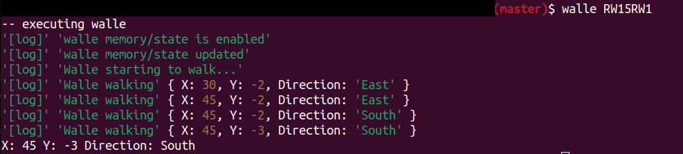

#### Walle

#### [ Developed by Eaglex ](http://eaglex.net)

#### About

- Teach Walle how to walk using cli commands
- Tells app/robot to move via cli commands



#### Install

- `npm i` or `npm link`
- Set your minimum nodejs and npm to versions specified in `package.json`
- To run code/lint: `npm run lint:install` then `npm run lint`

#### Start

There are two ways to run this app, _after you installed it_:

1. `/$ walle RW15RW1` if you first run `npm link`
2. example: `/$ node start RW15RW1`

- Application executes from ./libs/execute.js
- To enable memory state from previous cli execution, set `{memory:true}` in ./libs/execute.js, this will add another dir called `./memory/walle_state.json`

#### Deadline

1 days.

#### Commands explained:

- `W:integer` walk number of steps
- `L` turns left counterclockwise ( -90 )
- `R` turns right clockwise ( +90 )

* commands can be combined to a string without spaces to form navigation execution, example : `LW5RLW2`
  - this executes: turn left, walk 5 points, turn right, turn left again and walk 2 points

#### Examples:

```sh
# either use `node start {directions}` or `walle {directions}` (if `npm link` executed)

$/ walle W5RW5RW2RW1R
> X: 4 Y: 3 Direction: North

$/ walle RRW11RLLW19RRW12LW1
> X: 7 Y: -12 Direction: South

$/ walle LLW100W50RW200W10
> X: -210 Y: -150 Direction: West

$/ walle LLLLLW99RRRRRW88LLLRL
> X: -99 Y: 88 Direction: East

$/ walle walle W55555RW555555W444444W1
> X: 1000000 Y: 55555 Direction: East

```

#### Tests & Coverage

Not in scope of this project, maybe add it later

#### Stack

Application uses own-build externals `x-utils, x-fs`, found at (https://bitbucket.org/eag1ex) and (https://www.npmjs.com/~anon101)

- Full list: NodeJS, JavaScrit, es6, memory/state, cli/process.argv, npm, lint

#### Scope

```
./libs >
> execute.js
	> pre-process.js (sanitize entries)
		> Schema.js
		> Walle.js (main app)
```

#### Config

./config.js

#### Recommended VScode extensions

- `vscode-language-babe, vscode-babel-coloring, comment-anchors, joelday.docthis, vscode-standardjs`

#### Contact

Have questions, or would like to submit feedback, **contact me at:** (https://eaglex.net/app/contact?product=walle)

##### LICENSE

- LICENSE: CC BY-NC-ND
- SOURCE: _(https://creativecommons.org/licenses/by-nc-nd/4.0/)_

#### Thank you
